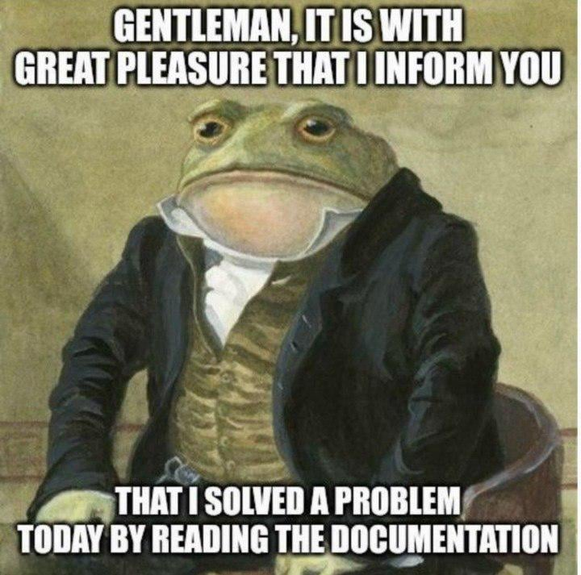

# Olá! 👋

Bem-vindo ao meu perfil! Aqui é um lugar onde você vai encontrar meus
projetos pessoais e outros que eu contribuí.

Gosto de:
- Linux (uso [Alpine Linux](https://alpinelinux.org) como daily-driver)
- Projetos Open-Source
- Software minimalistas
- Computação retrô

(também tem o meu [site](https://tukainpng.neocities.org), dá uma olhadinha
depois :D)

  

  

